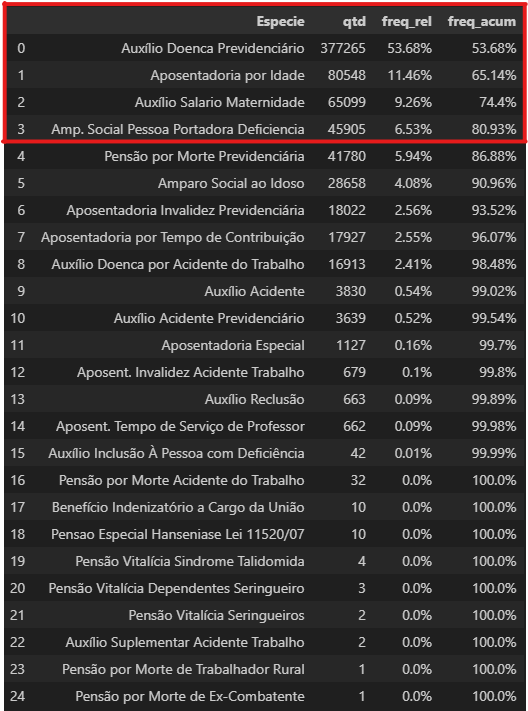

## Análise Exploratória - 

### O objetivo dessa análise é trazer um recorte concessões de benefícios junto ao INSS.

Pareto de que representa 80% das concessões dentro todos os tipos aposentadorias, auxílios.

Em abril/2024 apenas 4 benefícios já representam 80%* do total de concessões:

